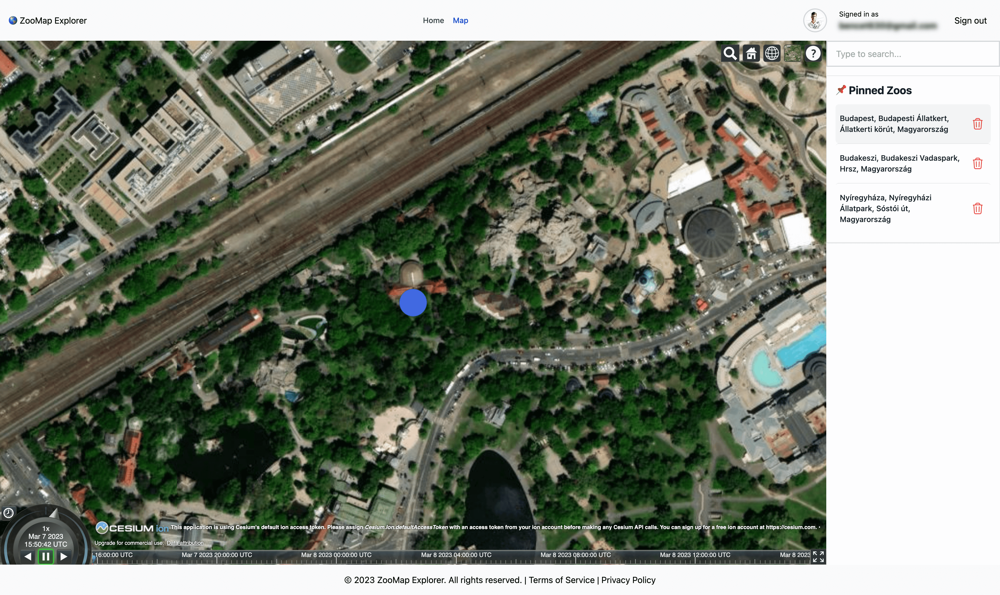

# 🌎 ZooMap Explorer

## Overview

Introducing our latest application built on Next.js, a powerful and efficient React-based framework for building web applications. Our application provides users with the ability to search and add new items on the map. With its easy-to-use interface, users can authenticate with their email or GitHub accounts, and start exploring and interacting with our application.

<p align="center">
    
</p>

### Features

- Authentication with email and Github
- Cesium map with 3D geospatial data visualization
- Sidebar displaying Zoo building names that can be deleted
- Responsive design that works on all devices
- Form validation with Formik library
- MongoDB database for secure user credential storage
- Utilizes React, Next.js, Redux Toolkit, Tailwind CSS, and Cesium

Our application features a Cesium map, a powerful geospatial platform that allows users to visualize, analyze and share 3D geospatial data. The map provides users with a comprehensive view of the locations of Zoo buildings and allows them to easily search for their desired location.

To make the application more user-friendly, we've added a sidebar that displays the list of Zoo building names. Users can quickly navigate through the list and delete any building that they no longer need.

The application's responsive design ensures that it can be accessed from any device, be it a desktop, tablet or mobile device. This makes it convenient for users to search and add new items to the map, no matter where they are.

Our authentication providers include email and GitHub, ensuring that users can easily log in and start using the application without any hassle. We've also integrated Formik, a popular library for validating forms in React, to make sure that any user input is accurate and error-free.

In addition to React and Next.js, we've utilized Redux Toolkit, a popular state management library, to simplify the application's state management. Tailwind CSS, a utility-first CSS framework, has also been used to provide users with a sleek and modern UI.

Finally, to ensure that user data is secure, we've used MongoDB, a popular NoSQL database, to store user credentials. This ensures that user data is protected and remains safe.

Overall, our Next.js-based application provides users with a seamless and intuitive experience when searching and adding new items on the map. With its powerful geospatial capabilities, responsive design, and secure authentication, our application is a must-have for anyone looking to explore and interact with locations on the map.

## Getting Started

### 1. Clone the repository and install dependencies

```
git clone https://github.com/nagybnc/zoomap-explorer.git
cd zoomap-explorer
npm install
```

### 2. Configure your local environment

Copy the .env.local.example file in this directory to .env.local (which will be ignored by Git):

```
cp .env.local.example .env.local
```

Add details for providers (e.g. Google, GitHub, Email, etc).

### 4. Start the application

To run your site locally, use:

```
npm run dev
```

To run it in production mode, use:

```
npm run build
npm run start
```
